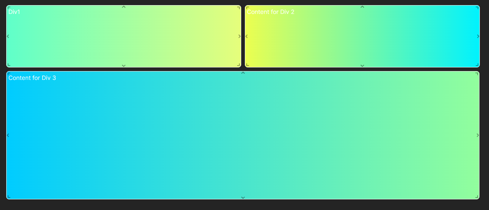

# React-grid-layout Componets

react-grid-layout is a popular React library used for building draggable and resizable grid layouts. It provides a flexible grid system that allows users to create complex layouts by arranging components in rows and columns. Some key features of react-grid-layout include:

Draggable Components: Components can be easily dragged and rearranged within the grid layout.
Resizable Components: Components can be resized dynamically by dragging their edges or corners.
Responsive Layouts: Supports responsive designs, allowing layouts to adapt to different screen sizes.
Persistent Layouts: Supports saving and restoring layout configurations.
Configurable Grid: Grid properties such as row height, column count, margins, and breakpoints can be customized.
Collision Detection: Automatically prevents components from overlapping when dragged.
Event Handling: Provides various event handlers for handling layout changes, resizing, and dragging.
Overall, react-grid-layout simplifies the process of creating flexible and interactive grid-based layouts in React applications.




## Getting Started

To get started with the project, follow these steps:

1. Go to the project directory.
2. Install dependencies by running:
   
   ```bash
   npm install --force
3. Run Project by:
   
   ```bash
   npm run dev

  